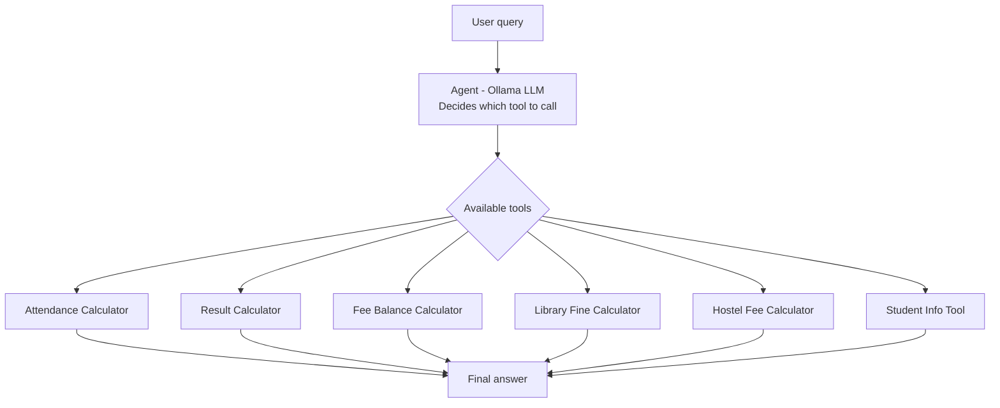

# Smart College Assistant

An AI-powered college assistant using LangChain's Tool Calling Agent. It automatically identifies the type of student query and invokes the correct tool to compute the answer.

## Tools

| Tool | Inputs | Output |
|------|--------|--------|
| Attendance Calculator | Total classes, Attended classes | Attendance %, Exam eligibility |
| Result Calculator | 5 subject marks | Average, Grade, Pass/Fail |
| Fee Balance Calculator | Total fee, Amount paid | Pending fee amount |
| Library Fine Calculator | Delayed days | Fine (₹5/day) |
| Hostel Fee Calculator | Monthly fee, Months stayed | Total hostel fee |
| Student Info Tool (Bonus) | Student ID | Name, Course, Year |

## Tech Stack
- **Python**
- **LangChain** (`langchain_classic.agents` — `create_tool_calling_agent`, `AgentExecutor`)
- **Ollama** running `llama3.2` — free, local LLM, no API key required
- **ChatPromptTemplate** for structured system instructions

## Setup
1. Install [Ollama](https://ollama.com) and pull a model:
```bash
ollama pull llama3.2
```
2. Install dependencies:
```bash
pip install langchain langchain-classic langchain-ollama langchain-core
```
3. Run:
```bash
python college_assistant.py
```

## Usage
On running, the script:
1. Executes the 6 required test cases (with `verbose=True`, showing the agent's full reasoning + tool calls)
2. Enters an **interactive mode** where you can type any query in natural language

## How It Works


## Example Queries
I attended 56 classes out of 76, can I attend exams?
I scored 68, 47, 56, 89 and 73. What grade will I get?
Give me details for student S110
I attended 60/70 classes, scored 67,88,45,91,54, paid 1,02,000 of 1,95,000 — give me my full status

The last example demonstrates **multi-tool invocation** — the agent calls `attendance_calculator`, `result_calculator`, and `fee_balance_calculator` in one go and returns a consolidated summary.

## Design Notes / Lessons Learned

- **Tool docstrings matter as much as code logic.** Early versions had the agent confuse `hostel_fee_calculator` with `fee_balance_calculator` when a user asked "how much hostel fee is left to pay" — fixed by making docstrings explicitly disambiguate intent ("use ONLY when... NOT for...").
- **System prompt engineering reduces hallucination.** Small local models (3B params) sometimes contradict their own tool outputs in the final summary (e.g., correctly computing "Not Eligible" but then saying "you are eligible"), or omit fields the tool already returned. Explicit rules in the system prompt — "use the tool's exact result," "report every field returned" — significantly improved response accuracy.
- **Local models trade some coherence for zero cost/setup.** For production use, a larger model (e.g., `qwen2.5:7b` or a hosted API model) would give more consistent natural-language summaries while keeping the same tool-calling architecture.

## License

MIT
