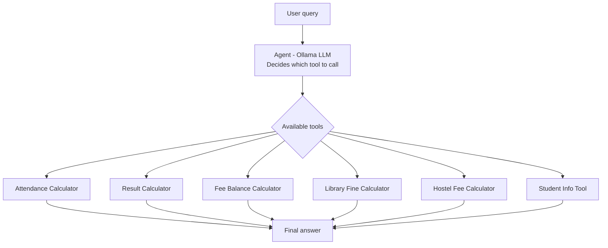

# Smart College Assistant

An AI-powered college assistant using LangChain's Tool Calling Agent. It automatically identifies the type of student query and invokes the correct tool to compute the answer.

## Tools

| Tool | Inputs | Output |
|------|--------|--------|
| Attendance Calculator | Total classes, Attended classes | Attendance %, Exam eligibility |
| Result Calculator | 5 subject marks | Average, Grade, Pass/Fail |
| Fee Balance Calculator | Total fee, Amount paid | Pending fee amount |
| Library Fine Calculator | Delayed days | Fine (₹5/day) |
| Hostel Fee Calculator | Monthly fee, Months stayed | Total hostel fee |
| Student Info Tool (Bonus) | Student ID | Name, Course, Year |

## Tech Stack
- Python
- LangChain (langchain_classic agents)
- Ollama (llama3.2) — local LLM, no API key needed

## Setup
1. Install [Ollama](https://ollama.com) and pull a model:
```bash
ollama pull llama3.2
```
2. Install dependencies:
```bash
pip install langchain langchain-classic langchain-ollama langchain-core
```
3. Run:
```bash
python college_assistant.py
```

## Usage
The script runs the assignment's required test cases first (with `verbose=True` showing the agent's reasoning), then enters an interactive mode where you can type your own queries.

## How It Works


## Example Queries
I attended 56 classes out of 76, can I attend exams?

I scored 68, 47, 56, 89 and 73. What grade will I get?

Give me details for student S110

I attended 60/70 classes, scored 67,88,45,91,54, paid 1,02,000 of 1,95,000 — give me my full status

The last example demonstrates multi-tool invocation in a single query.
